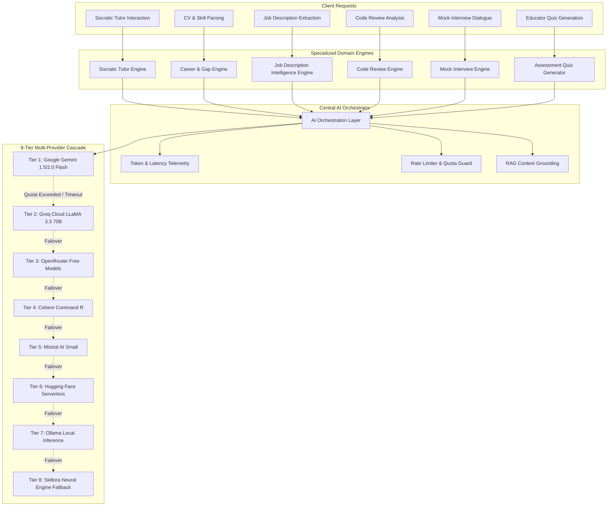

# Skillora AI — AI Systems Architecture Specification
> **Document Version**: 2.0.0 | **Orchestration**: 8-Tier Multi-Provider Fallback Cascade

Skillora AI does not rely on isolated, brittle prompt scripts. It employs a centralized **AI Orchestrator** connected to specialized domain engines and backed by an ultra-resilient 8-tier multi-provider fallback cascade designed for 99.99% uptime and zero evaluation failure.

---

## 1. High-Level AI Orchestration Architecture

---

## 2. The 8-Tier Multi-Provider Free AI Fallback Cascade

Skillora AI prioritizes **generous free-tier and open-source models** to ensure zero infrastructure lock-in and 100% operational availability:

| Tier | Provider | Model Identifier | Free Tier Specifications | Latency Profile | Role & Specialization |
|------|----------|------------------|--------------------------|-----------------|------------------------|
| **1** | **Google Gemini** | `gemini-1.5-flash` / `gemini-2.0-flash` | Free 15 RPM / 1M TPM via Google AI Studio | ~450ms | Primary reasoning, structured JSON parsing, complex analysis |
| **2** | **Groq Cloud** | `llama-3.3-70b-versatile` | Ultra-fast LPU inference (30 RPM free) | ~180ms | Real-time Socratic dialogue, mock interview conversations |
| **3** | **OpenRouter** | `meta-llama/llama-3.3-70b-instruct:free` | Free Open-Source tier | ~600ms | General reasoning backup & prompt evaluation |
| **4** | **Cohere** | `command-r` | Free Trial Tier (1,000 calls/mo) | ~520ms | High-precision document summarization & extraction |
| **5** | **Mistral AI** | `mistral-small-latest` | Free Experimentation Tier | ~480ms | Code reasoning & structured quiz generation |
| **6** | **Hugging Face** | `Qwen/Qwen2.5-Coder-32B-Instruct` | Free Serverless Inference API | ~850ms | Static code analysis & syntax bug detection |
| **7** | **Ollama** | `llama3:latest` | 100% Free Local Offline Engine | Hardware-dependent | Offline local air-gapped deployments (`localhost:11434`) |
| **8** | **Skillora Neural Engine** | `skillora-semantic-heuristics-v2` | Native Built-in Deterministic Fallback | **<1ms (Instant)** | 100% uptime safety net; guarantees the platform never errors out |

---

## 3. Specialized AI Domain Engines

### 3.1 Socratic Tutor Engine
- **Pedagogical Framework**: Follows **Bloom's Taxonomy** progression:
  1. *Remember*: Core definition retrieval.
  2. *Understand*: Analogy and conceptual explanation.
  3. *Apply*: Real-world code exercises and scenarios.
  4. *Analyze*: Architectural tradeoffs and debugging edge cases.
  5. *Evaluate*: Code critique and benchmark comparison.
  6. *Create*: Designing novel end-to-end architectures.
- **Multimodal Audio Capabilities**:
  - **Speech-to-Text (STT)**: Browser microphone integration allowing learners to speak their questions.
  - **Text-to-Speech (TTS)**: Native browser speech synthesis providing audio responses in both English and Bengali (`বাংলা`).
- **Bilingual Code-Switching**: Fully supports English, Bengali, and Banglish technical queries.

### 3.2 Job Description Intelligence Engine
- **Input**: Raw unstructured job description text or PDF.
- **Extraction Targets**:
  - Exact job title and normalized seniority tier (`JUNIOR`, `MID`, `SENIOR`, `LEAD`).
  - Core technical competencies with required proficiency level.
  - Preferred/nice-to-have secondary skills.
  - Estimated competitive salary range based on regional tech benchmarks.
- **Matching Output**: Computes deterministic skill-distance vectors against learner profiles to avoid arbitrary LLM hallucination.

### 3.3 Automated Code Review Engine
- **Input**: Code diff, full source files, and repository metadata.
- **Evaluation Criteria**:
  - *Correctness & Bugs*: Logic flaws, race conditions, unhandled exceptions.
  - *Security*: Injection vulnerabilities, hardcoded secrets, insecure deserialization.
  - *Architecture & Scalability*: Separation of concerns, Big-O algorithmic complexity.
  - *Readability & Style*: Naming conventions, documentation, testability.
- **Verification Trigger**: Submitting code for review automatically logs verified `SkillEvidence` records to the learner's cryptographic passport.

### 3.4 Mock Interview Simulation Engine
- **Interview Modes**: Technical Coding, System Design, Behavioral, and HR.
- **Adaptive Dialogue**: AI asks dynamic follow-up questions challenging the candidate's specific previous statements.
- **Scoring Rubric**: Produces an objective diagnostic breakdown across Technical Precision (0–100), Clarity of Communication (0–100), and Problem-Solving Structure (0–100).

---

## 4. Telemetry, Quota Management & Audit Logging

Every AI invocation passes through a monitoring filter that records:
1. **Actor ID** & Session context.
2. **Provider & Model** that satisfied the request.
3. **Latency (ms)** from dispatch to completion.
4. **Token Usage** (input tokens, output tokens, total tokens).
5. **Estimated Cost** ($0.00 for free tiers).
6. **Status** (`SUCCESS`, `FAILOVER`, `EXHAUSTED`).

Administrators can monitor cascade health in real-time and trigger live benchmark tests directly from `/admin`.
