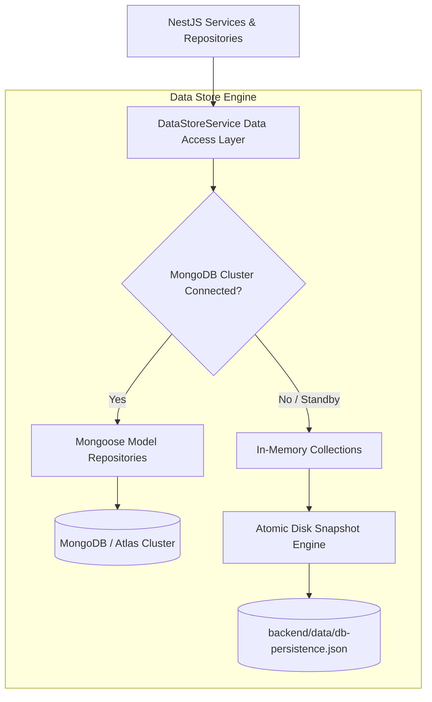

# Skillora AI — Database Architecture & Schema Specification
> **Document Version**: 2.0.0 | **Persistence Layer**: Dual-Mode (MongoDB + Atomic Durability Snapshot)

This document specifies the persistence architecture, the complete catalog of 39 domain models, indexing strategies, seed initialization, and migration pathways for Skillora AI.

---

## 1. Dual-Mode Persistence Architecture

Skillora AI implements a dual-mode persistence architecture:



### Key Architectural Characteristics
1. **MongoDB Mode**: When `MONGODB_URI` points to an accessible MongoDB cluster (local or MongoDB Atlas), entities are directly persisted and queried using standard Mongoose ODM models.
2. **Atomic Snapshot Durability Mode**: In development environments or environments without an external MongoDB cluster running, the system utilizes an atomic disk snapshot engine (`backend/data/db-persistence.json`) with `fsync` write guarantees. **Application state, user registrations, assessments, and job applications are never lost across server restarts.**
3. **Unified Schema Contracts**: All 39 entities strictly adhere to TypeScript interfaces and Mongoose schema definitions located in `backend/src/database/schemas/`.

---

## 2. Catalog of 39 Domain Entities & Schemas

The 39 domain entities are organized into 13 modular schema files in `backend/src/database/schemas/`:

| Schema File | Domain Entities Included | Key Attributes & Capabilities |
|-------------|--------------------------|--------------------------------|
| `user.schema.ts` | **User**, **Subscription**, **DeviceSession** | Email, passwordHash, role (`LEARNER`, `EDUCATOR`, `EMPLOYER`, `ADMIN`), emailVerified, verificationTokenHash, resetTokenHash, subscription tier (`FREE`, `PRO`, `ENTERPRISE`). |
| `profile.schema.ts` | **Profile**, **Education**, **Experience**, **Certification**, **GitHubProfile** | Bio, headline, targetRole, location, remotePreference, CV URL, parsed CV text, GitHub repository stats, verified credentials. |
| `skill.schema.ts` | **Skill**, **UserSkill**, **SkillEvidence** | Skill slug, category, difficulty, prerequisites, user proficiency (`BEGINNER` to `EXPERT`), confidence score, verification source (`ASSESSMENT`, `PROJECT`, `AI_INFERRED`), verification timestamp. |
| `career.schema.ts` | **CareerGoal**, **CareerPath**, **CareerRecommendation**, **SkillGap** | Target career, target salary, target timeline, missing skills, prioritized gap distance, learning order, transferable skills analysis. |
| `job.schema.ts` | **Job**, **JobApplication**, **Company**, **SavedJob** | Title, companyId, salary, location, remoteType, requiredSkills, preferredSkills, ATS stage (`APPLIED`, `AI_SCREENED`, `INTERVIEW_SCHEDULED`, `VERIFIED_OFFER`, `HIRED`), blind hiring toggle. |
| `learning.schema.ts` | **Course**, **Enrollment**, **LearningResource**, **SavedResource** | Course title, educatorId, curriculum modules, enrollment status, progress percentage, completion date, external resource metadata. |
| `roadmap.schema.ts` | **Roadmap**, **RoadmapTask**, **Milestone** | Personalized SkillBridge path, targetRole, daily tasks, weekly milestones, estimated hours, completion state, adaptive difficulty factor. |
| `assessment.schema.ts` | **Assessment**, **AssessmentAttempt**, **Question**, **Certificate** | Exam metadata, question bank (MCQ, code snippet, scenario), user answers, automated score breakdown, cryptographic certificate with unique ID (`SKL-VERIF-XXXX-2026`). |
| `project.schema.ts` | **Project**, **ProjectSubmission**, **CodeReview**, **Portfolio** | Project specifications, GitHub repo URL, live demo URL, AI automated code review (bugs, security, architecture, performance), portfolio item showcase. |
| `interview.schema.ts` | **Interview**, **InterviewSession**, **InterviewFeedback** | Role type, difficulty, transcript, AI interviewer questions, diagnostic scores (technical accuracy, communication, problem-solving). |
| `communication.schema.ts` | **Notification**, **Conversation**, **Message** | Notification type, read/unread state, action link, direct messaging between employer/candidate or educator/learner. |
| `analytics-audit.schema.ts` | **AnalyticsEvent**, **AIUsage**, **AuditLog**, **Cohort** | Event name, actor ID, payload, token usage, latency, provider model, admin audit log (IP, user agent, action), educator student cohort. |
| `knowledge.schema.ts` | **KnowledgeDocument**, **KnowledgeChunk** | RAG knowledge base document, content chunks, source URL, embedding vector reference, confidence score. |

---

## 3. Database Indexing Strategy

To support high-throughput read/write operations and sub-50ms search queries, the following indexes are defined:

### 3.1 Unique Constraints
- `users`: `{ email: 1 }` (unique, lowercase, sparse: false)
- `skills`: `{ slug: 1 }` (unique, lowercase)
- `certificates`: `{ certificateId: 1 }` (unique, sparse: false)
- `companies`: `{ slug: 1 }` (unique)

### 3.2 Compound & Lookup Indexes
- `job_applications`: `{ jobId: 1, userId: 1 }` (unique compound index prevents duplicate submissions)
- `job_applications`: `{ employerId: 1, stage: 1, createdAt: -1 }` (powers the ATS Kanban board)
- `user_skills`: `{ userId: 1, skillId: 1 }` (fast user skill lookups)
- `roadmap_tasks`: `{ roadmapId: 1, order: 1, status: 1 }` (powers dynamic roadmap sequencing)
- `notifications`: `{ userId: 1, read: 1, createdAt: -1 }` (fast notification drawer rendering)
- `analytics_events`: `{ eventName: 1, createdAt: -1 }` (powers platform analytics aggregations)

### 3.3 Text Search Indexes
- `jobs`: `{ title: "text", description: "text", "requiredSkills.name": "text" }`
- `skills`: `{ name: "text", category: "text", description: "text" }`
- `profiles`: `{ headline: "text", bio: "text", location: "text" }`

---

## 4. Canonical Seed Initialization Strategy

The platform ships with a canonical seed initialization engine (`backend/src/database/seed-data.ts`) executed on initial startup if the database is unpopulated:

1. **System Users**:
   - **Learner Persona**: `learner@skillora.ai` (pre-populated with verified skills in React, TypeScript, Node.js)
   - **Educator Persona**: `educator@skillora.ai` (assigned to enterprise full-stack cohorts)
   - **Employer Persona**: `employer@skillora.ai` (managing TechCorp Global job listings)
   - **Admin Persona**: `admin@skillora.ai` (platform governance)
   - *All seed accounts use securely hashed passwords (`bcrypt` 10 rounds).*
2. **Canonical Skill Taxonomy**:
   - 14 core technology skills spanning Frontend (`React`, `TypeScript`, `Next.js`), Backend (`Node.js`, `NestJS`, `Python`), Database (`PostgreSQL`, `MongoDB`), Cloud (`Docker`, `Kubernetes`, `AWS`), and AI (`LLMs`, `RAG`).
3. **Enterprise Jobs & Companies**:
   - 8 active job postings with structured skill requirements, salary brackets, and active applicant pipelines.
4. **Verified Assessment Catalog**:
   - Technical exams across JavaScript/TypeScript Core, Python Architecture, and System Design.

---

## 5. Connecting External MongoDB (Production / Atlas)

To point the backend to an external MongoDB instance or MongoDB Atlas cluster, update `backend/.env`:

```env
# MongoDB Connection String (Atlas or Local)
MONGODB_URI=mongodb+srv://<username>:<password>@cluster0.example.mongodb.net/skillora?retryWrites=true&w=majority

# Optional connection pool configuration
MONGODB_MAX_POOL_SIZE=50
MONGODB_MIN_POOL_SIZE=5
```

When started with a valid `MONGODB_URI`, the NestJS Mongoose module establishes a pooled connection, registers all 13 schemas, and applies text indexes automatically.
