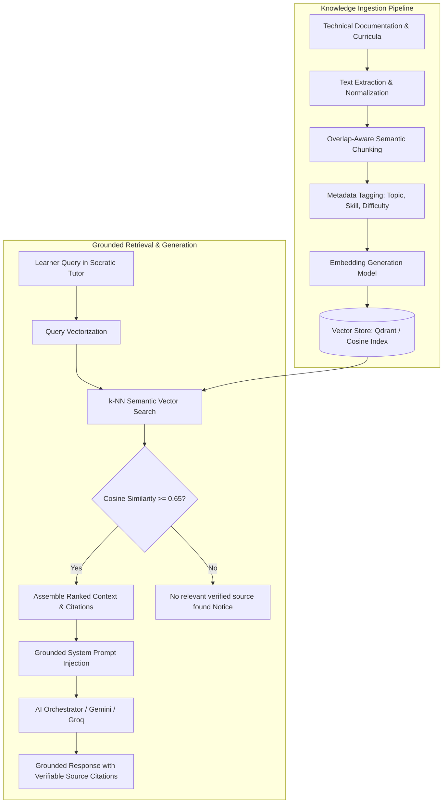

# Skillora AI — Retrieval-Augmented Generation (RAG) Architecture
> **Document Version**: 2.0.0 | **Grounding Standard**: Verifiable Academic & Technical Citations

Skillora AI implements an end-to-end Retrieval-Augmented Generation (RAG) pipeline to ground all educational and tutoring conversations in verified technical and workforce literature. This prevents AI hallucinations and provides learners with verifiable source citations.

---

## 1. End-to-End RAG Ingestion & Query Pipeline



---

## 2. Ingestion & Semantic Chunking Strategy

### 2.1 Chunking Parameters
- **Chunk Size**: 512 tokens (~1,800 characters)
- **Chunk Overlap**: 64 tokens (~220 characters)
- **Boundary Detection**: Splits along paragraph, code block, and markdown header boundaries to preserve structural coherence.

### 2.2 Metadata Schema
Every indexed chunk is enriched with strict metadata:
```json
{
  "chunkId": "chk_fe_react_hooks_042",
  "documentId": "doc_react_official_docs_v19",
  "title": "React 19 Hooks and Concurrency Primitives",
  "sourceUrl": "https://react.dev/reference/react",
  "category": "Frontend Engineering",
  "skillSlug": "react",
  "difficulty": "INTERMEDIATE",
  "contentSnippet": "useEffect is a React Hook that lets you synchronize a component with an external system...",
  "checksum": "sha256:8f4c2e..."
}
```

---

## 3. Vector Database Architecture & Qdrant Integration

### 3.1 Primary Vector Store: Qdrant
- **Vector Dimension**: 768 or 1536 (supports Google Text-Embedding-004 and standard embedding models).
- **Distance Metric**: `Cosine`.
- **Payload Indexing**: Filtered search by `skillSlug`, `difficulty`, and `category`.

### 3.2 Dual-Mode Fallback: In-Memory Vector Index
In development or edge environments where an external Qdrant instance is not reachable, Skillora AI initializes a local in-memory cosine similarity vector index using normalized TF-IDF and dense embeddings.

---

## 4. Grounded Citations & Anti-Hallucination Guardrails

### 4.1 Strict Similarity Cutoff
- **Confidence Threshold**: `0.65`.
- If the top retrieved candidate chunk has a cosine similarity score below `0.65`, the system **refuses to fabricate sources**.
- Instead, the Socratic Tutor explicitly outputs:
  > *"No verified documentation exists in the Skillora Knowledge Base for this specific edge case. The following explanation is based on general foundational principles."*

### 4.2 Citation Formatting
When relevant documents are retrieved, the AI response includes verifiable citation badges:
```markdown
Here is how you handle memory leaks in React cleanup functions:
...

---
**Verified References**:
1. [React 19 Official Documentation](https://react.dev/reference/react/useEffect) — *Section: Cleaning up after effects* (Relevance: 94%)
2. [Skillora Advanced Frontend Curriculum](https://skillora.ai/curricula/fe-mastery) — *Module 4: React Concurrency* (Relevance: 88%)
```
