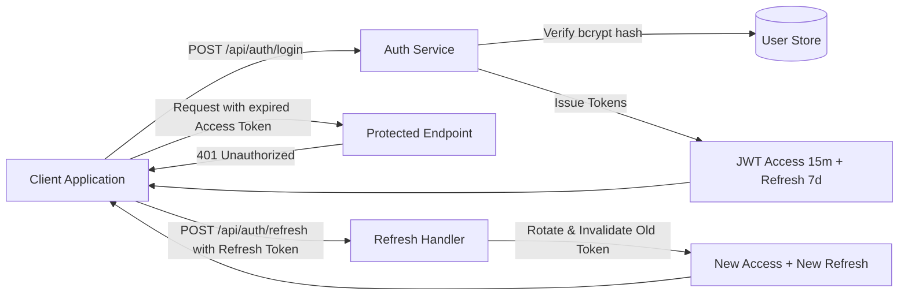

# Skillora AI — Security Architecture & Threat Mitigation Guide
> **Document Version**: 2.0.0 | **Compliance Target**: OWASP Top 10 | **Security Level**: Enterprise Ready

This document details the security controls, authentication safeguards, access control policies, and threat mitigations implemented across Skillora AI.

---

## 1. Authentication & Token Architecture

### 1.1 Password Security
- **Algorithm**: `bcrypt` with a cost factor of **10 salt rounds**.
- Plaintext passwords are never persisted to disk, never logged to stdout, and never returned in API payloads.

### 1.2 Access & Refresh Token Rotation
- **Access Tokens**: Short-lived JSON Web Tokens (15-minute expiration) signed with an HMAC-SHA256 secret.
- **Refresh Tokens**: Cryptographically random strings with 7-day expiration. Upon each exchange via `/api/auth/refresh`, the previous refresh token is immediately invalidated and a brand-new token pair is issued (Refresh Token Rotation).

### 1.3 Cryptographic Token Hashing
- **Email Verification & Password Reset Tokens**: Never stored in plaintext. Tokens are hashed using **SHA-256** prior to database persistence. Stolen database dumps cannot be leveraged to hijack accounts or reset passwords.

---

## 2. Authorization & Access Controls

### 2.1 Role-Based Access Control (RBAC)
Skillora AI defines 4 distinct platform roles:
1. `LEARNER`: Standard student / candidate account.
2. `EDUCATOR`: Course instructor, mentor, and cohort leader.
3. `EMPLOYER`: Enterprise hiring manager and recruiter.
4. `ADMIN`: Platform infrastructure and policy governor.

**Public Registration Boundary**:
The public registration endpoint (`POST /api/auth/register`) strictly validates roles against `[LEARNER, EDUCATOR, EMPLOYER]`. **Any registration request specifying `ADMIN` is rejected with an HTTP 403 Forbidden exception.** Admin accounts can only be provisioned internally through privileged CLI seeds or elevated by an existing verified Admin.

### 2.2 Resource Ownership Authorization (`ResourceOwnerGuard`)
Role checks alone do not prevent Insecure Direct Object References (IDOR). Skillora AI enforces resource ownership verification across all sensitive mutations:
- A learner can only access and mutate their own profile, learning roadmap, exam attempts, and job applications.
- An employer can only view candidates applied to their own company's jobs and manage their own hiring pipeline.
- An educator can only edit courses and cohorts assigned to their educator ID.

---

## 3. Email Verification & Dispatch Architecture

Skillora AI implements an abstracted `EmailService` supporting 3 decoupled operational modes:
1. **Resend API Provider**: High-deliverability transactional email delivery in production.
2. **SMTP Relay Provider**: Universal fallback for enterprise mail relays.
3. **Development Console Adapter**: Securely logs verification links to internal developer telemetry in local environments.

**Zero Fake Verification Bypasses**: The production frontend does not contain hardcoded "simulate verification" buttons or fake email links. Verification requires possessing the cryptographic token dispatched by the `EmailService`.

---

## 4. Input Validation & Injection Defense

### 4.1 Strict Global ValidationPipe
Every inbound HTTP request passes through NestJS's global `ValidationPipe`:
- `whitelist: true`: Strips any extraneous properties not explicitly defined in the DTO schema.
- `forbidNonWhitelisted: true`: Immediately rejects payloads containing unmapped properties.
- `transform: true`: Coerces query parameters and path IDs to their declared TypeScript types.

### 4.2 Cross-Site Scripting (XSS) & SQL/NoSQL Injection Mitigation
- React 19 / Next.js auto-escapes all rendered text nodes.
- Mongoose ODM parameterized queries eliminate raw string concatenation, completely preventing NoSQL injection attacks.

---

## 5. Security Headers, CORS & Rate Limiting

- **Cross-Origin Resource Sharing (CORS)**: Restricted to verified origin whitelist defined in `CORS_ORIGINS`. Credentials mode enabled (`credentials: true`).
- **Rate Limiting**: Rate limits enforced on `/api/auth/login`, `/api/auth/register`, `/api/auth/forgot-password`, and all AI generation endpoints.
- **Audit Logging**: Sensitive administrative actions (role changes, cascade benchmarks, user suspensions) generate immutable records containing timestamp, actor ID, and IP address.
